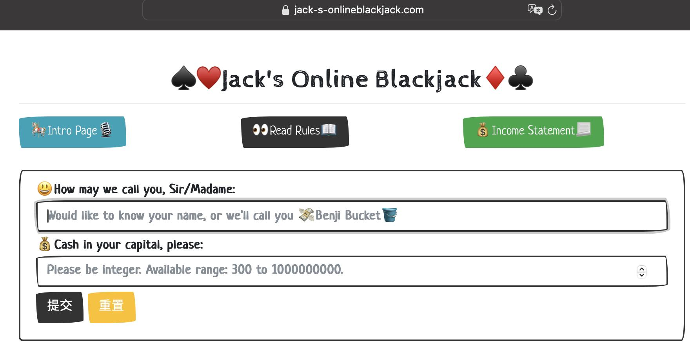
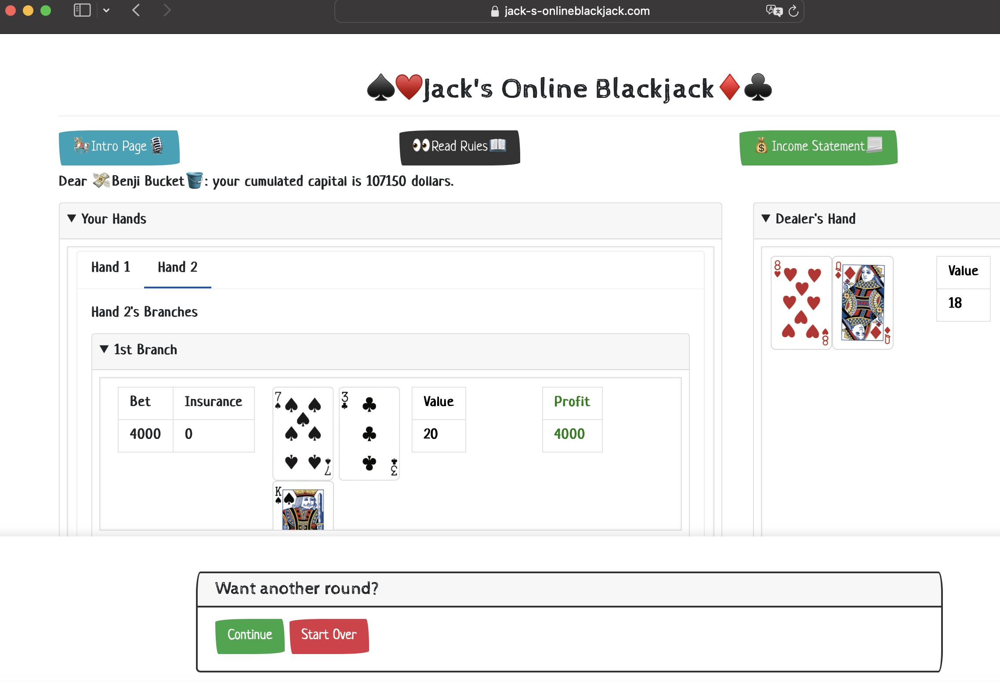
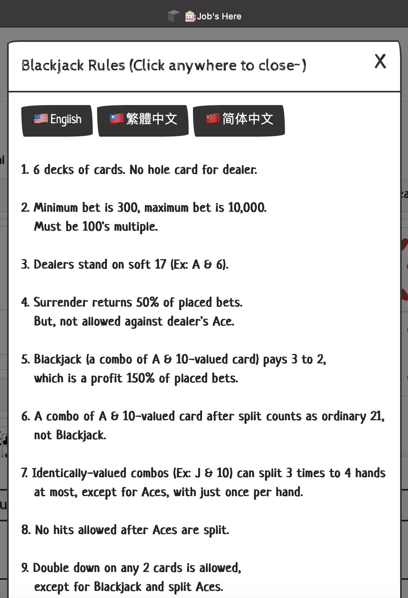
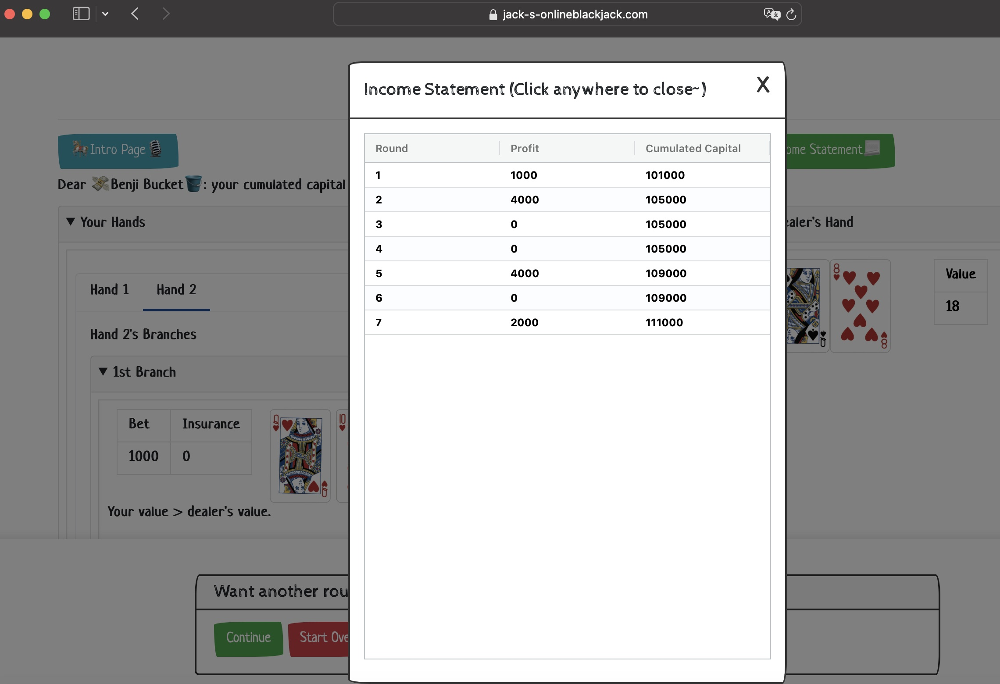
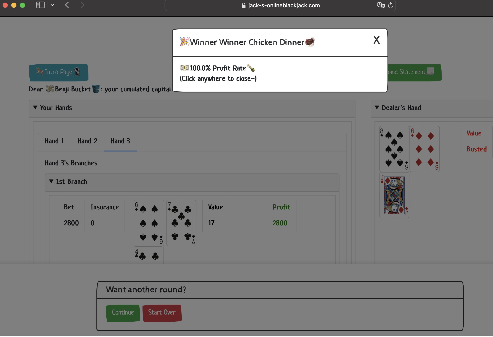
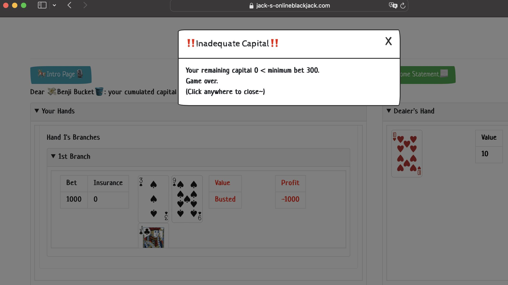
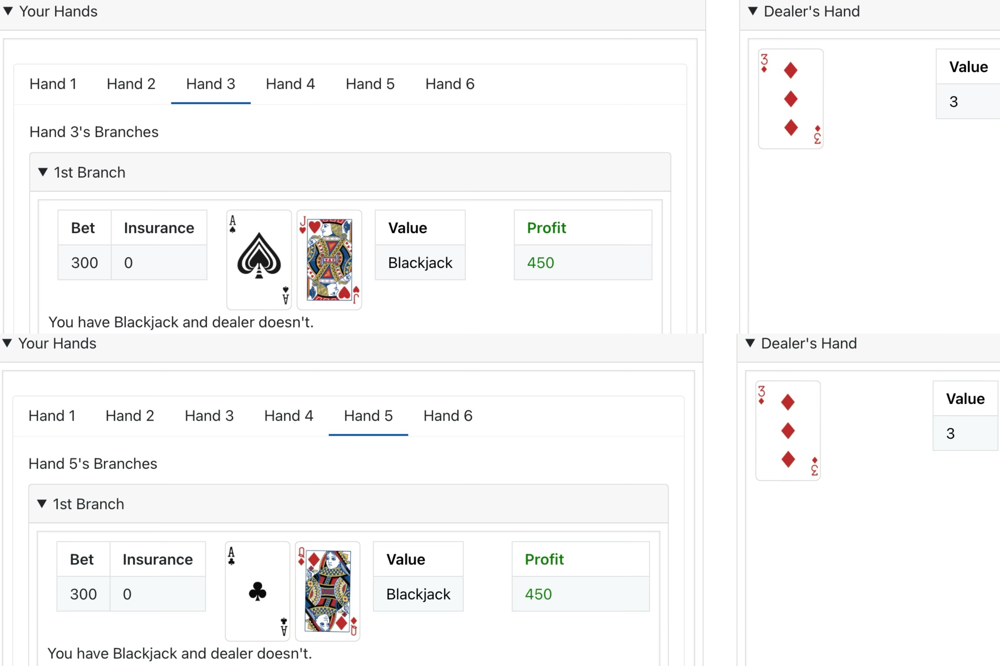

# Archived Version 1️⃣

Just a record of how this Blackjack game has evolved.

Still can't believe that in 2024, I really used PyWebIO as frontend 🤣

Fortunately later I realized how to do frontend in a more proper manner 😆

### JOB's Here: Jack's Online Blackjack 🎰🃏
A paid job is essential but often stressful 😵

Here is a pure-fun & pressure-less "job" 😀

For better view, please use PC or tablets to play this game~

(Trust me, you won't like the view on smartphone browsers lol)

### Blackjack: Probabilities Game 🔢
Don't worry if you aren't familiar with Blackjack. Check it out: https://www.wikihow.com/Play-Blackjack

https://www.wikihow.com/Sample/Blackjack-Rules: casinos share general rules, and differ in a few variations.

https://www.wikihow.com/Sample/Blackjack-Chart: each variation has own basic strategy. Here is a general version.

For more info, just Google "Blackjack Rules" & "Blackjack Basic Strategy".

### Why This Repo Is Named "Monkey" 🤔
🐒 Monkeys refer to face cards (J, Q, K) & 10. 10-valued cards are super impactful on game results.

With more playing, you will see why you want monkeys to be your friends 😎

### Demos 🖥️
Now let's dive into some demos 🤓

#### Simple Manipulation ⌨
How you "fill online forms" is how you play this game.

Keyboard enters capital/chip amount.

Mouse clicks decisions and switches between tabs.

Always scroll down for more content of a single tab.

#### Home Page
Enter your capital amount and everything is set.

Default player name "Benji Bucket": inspired by another popular repo Bitbucket, and "Benjamins", nickname of US$100 🤪

#### Blackjack Page

For easy query, 3 buttons are hanging on top:

(1) Intro Page: that's how you are visiting this repo 😉

(2) Read Rules: English, Traditional & Simplified Chinese are offered.
Now you know where I am from 🤭

(3) Income Statement: 💸 income flow is well recorded like a bank 🏦

(Still unbelievable non-losing flow……🤣)

#### 🎉 Winner Winner Chicken Dinner 🦃
Congratulate whoever wins big in a single round 🤑

#### Bankruptcy 😥
Game over happens when you lose too much.

Want to start over? Hit your browser's refresh button 👌 (it "wipes away" all records you accumulate.)

#### Last But Not Least
(1) Ideas are always welcomed: whenever you have them, please feel free to let me know.

Just post anything you like in this repo's "Issues" area.
Screenshots are very helpful especially if you find bugs~

(2) Of course, in reality I still have a paid job to do.

I may not answer immediately, but I'll try my best to answer and fix anything you post 😬

Hope everyone enjoys Jack's Online Blackjack and encounter as many Blackjacks as you can 🍻

(I once had two Blackjacks in a single round hahaha)
