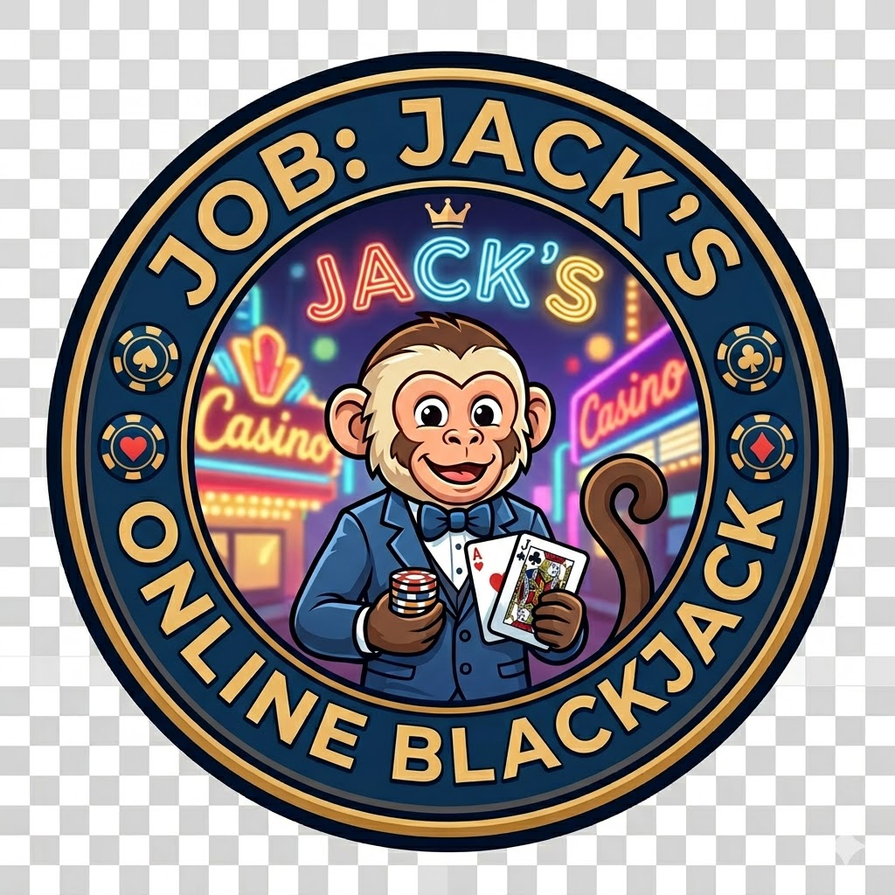

  

# 🎰MonkeyJOB: Jack's Online Blackjack

---

### 🛰️ Metadata

---

### [🤵🏻 Let's Have A Seat 🐵](https://www.jack-s-onlineblackjack.com)

### [📓 Stories Behind 😸](https://starsexpress.github.io/Faraway-s-Way/monkeyjob/)

---

### 🛠 Tech Ingredients Revealed
#### 1️⃣ Backend

- Python — entire Blackjack game engine and backend modules.
- FastAPI — serves all players separately, and responds accordingly to players' interactions.

#### 2️⃣ Frontend

- JavaScript + CSS + HTML — makes everything feel like casinos vibes through detailed interactions.

#### 3️⃣ CI/CD

- Pytest — unit, component and integration tests.
- GitHub — CI/CD pipeline triggers.
- Railway — game deployment.

---

### 💽 Not Just A Repo 🗃

Like I said in the game's popup, if you have any ideas, **please feel free to post in this repo's Issues**.

Especially if you discover bugs, then I am very willing to know and debug for us 🙏
